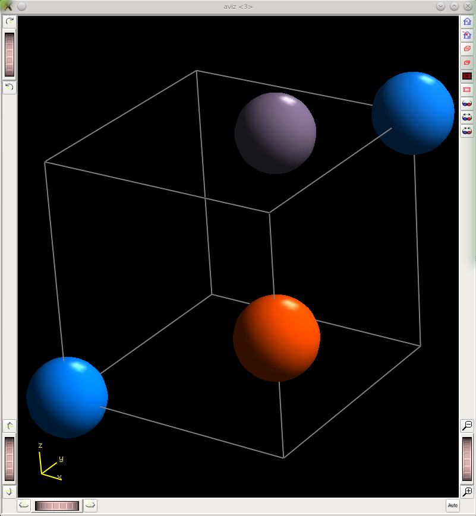
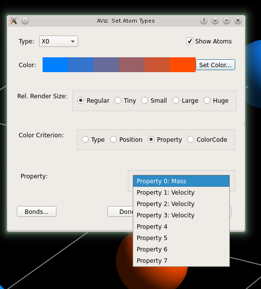

SimPhoNy Plugin
===============

AViz tools are available in the SimPhoNy library through the
visualisation plug-in named ``aviz``.

e.g::

  from simphony.visualisation import aviz

Visualizing CUDS
----------------

The :func:`~simphony_aviz.show` function is available to
visualise the `Particles` CUDS dataset. The function will open a
AViz and allow the user to view and analyze the particles.

The :func:`~simphony_aviz.snapshot` create a snapshot of
the `Particles` CUDS dataset. The function will create a PNG image
of dataset.

Here is an example illustrating visualizing a particles dataset
in Aviz as well as using the Aviz plugin to take a snapshot:

.. literalinclude:: ../../examples/show_snapshot.py

The different attributes of the particles can be selected in AViz:

CUBA Attributes
---------------
Aviz can show up to 8 properties. To determine which properties should be
displayed, the individual particles of the dataset are queried. If there are
more than 8 properties, then the first 8 which were encountered are used.

Aviz displays floating point values so all integer values are converted to
floats when transferred to Aviz. Any attributes which have a type other than
integer or float are ignored.

.. note::
 Once simphony-aviz determines which attributes it will display, it assumes
 that each particle in the dataset contains those attributes.

Creating XYZ files
------------------
The ``simphony_aviz`` also provides a way to directly convert CUDS datasets
to xyz input files for AViz:

.. literalinclude:: ../../examples/write_xyz_file.py
